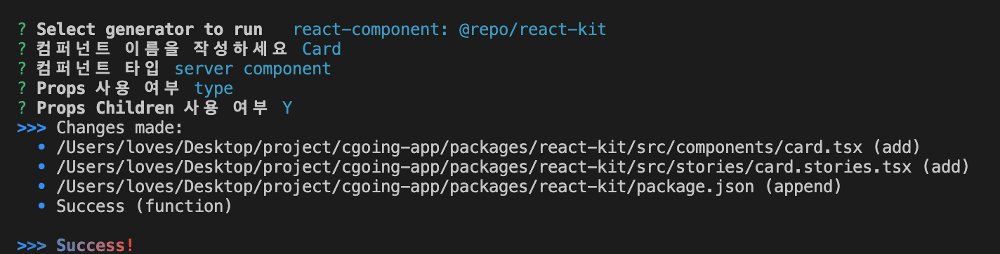

# @repo/react-kit

## 소개

`@repo/react-kit`는 React 애플리케이션 개발을 위한 UI 키트 및 재사용 가능한 커스텀 훅을 제공하는 라이브러리입니다. 이 패키지는 앱 개발시 일관된 UI 컴포넌트와 효율적인 상태 관리를 가능하게 해줍니다.

## 주요 기능

- **UI 컴포넌트**: 다양한 UI 컴포넌트를 제공하여 빠르고 쉬운 프론트엔드 개발을 지원합니다.
- **Custom Hooks**: 데이터 페칭, 상태 관리 등을 위한 여러 커스텀 훅을 포함하고 있어, 복잡한 로직을 쉽게 관리할 수 있습니다.
- **Storybook 통합**: 모든 컴포넌트는 Storybook으로 문서화되어 있어, 개발 과정에서 컴포넌트의 속성을 쉽게 확인하고 테스트할 수 있습니다.

## 개발 도구

- **Plop**: 컴포넌트 생성 시 일관성을 유지할 수 있도록 도와주는 Generator 툴을 사용하여 프로젝트의 구조를 표준화합니다. 명령어를 통하여 Component,story,export 를 생성합니다.
- **Tailwind CSS**: 유틸리티 우선의 CSS 프레임워크를 사용하여 스타일을 효율적으로 관리하고 커스터마이즈할 수 있습니다.

## 스크립트

- `yarn storybook`: 컴포넌트의 스토리북을 로컬 서버에서 실행합니다.
- `yarn build-storybook`: 스토리북을 정적 사이트로 빌드합니다.

## Component Generator

```bash
turbo gen react-component
```


